# Big Data Cloud Service- CE and Event Hub Workshop.

## Agenda
- Gain access to Oracle cloud using Public cloud Trial Account
- Explore My services
- Create a Storage Cloud service instance
- Create an Event hub service instance
- Create a BDCS-CE service instance
- Interactive processing
- Batch processing

**If you are an Oracle Employee/Partner with access to GSE (demo.oracle.com), you should follow the alternate Lab 100GSE instructions available here: [Workshop1.2.md](Workshop1.2.md)**

# Oracle Trial Account

Using a free Oracle Public Cloud Trial account you can investigate any of the Oracle **Infrastructure** or **Platform** Cloud Services.

To get an Oracle Trial account, please go the [Oracle Try It](https://cloud.oracle.com/tryit). From this website you can find answers to your questions concerning the Free Trial account, along with step by step instructions on how to register your account. After your account is provisioned, some of the services you may desire to use require that your Account's Storage Replication policy is set prior to using those services. Those instructions are provided later in this guide.

Along with the instruction provided on the Oracle website and **in this document**, you can Click on this [Video Link](https://publicdocs-corp.documents.us2.oraclecloud.com/documents/link/LD408AE98AE514A9D8A5B144F6C3FF17C1177E4725F3/fileview/D5BB8965F597992573C1B2A4F6C3FF17C1177E4725F3/_CloudCredits_VideoEdit.mp4) to view a short video showing how to acquire a trial account. 

## Step by step instructions on Provisioning your Account

### 1. View Details and Sign Up

- From the **TryIt** page, click on the **View Details & Sign Up** button

    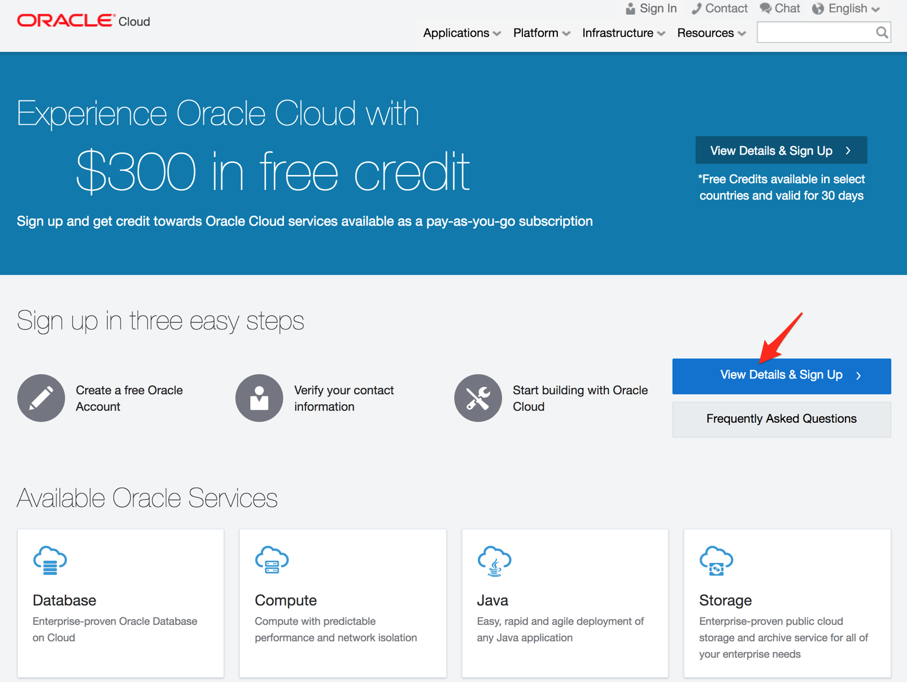

- Click on the **Get started for free** link

    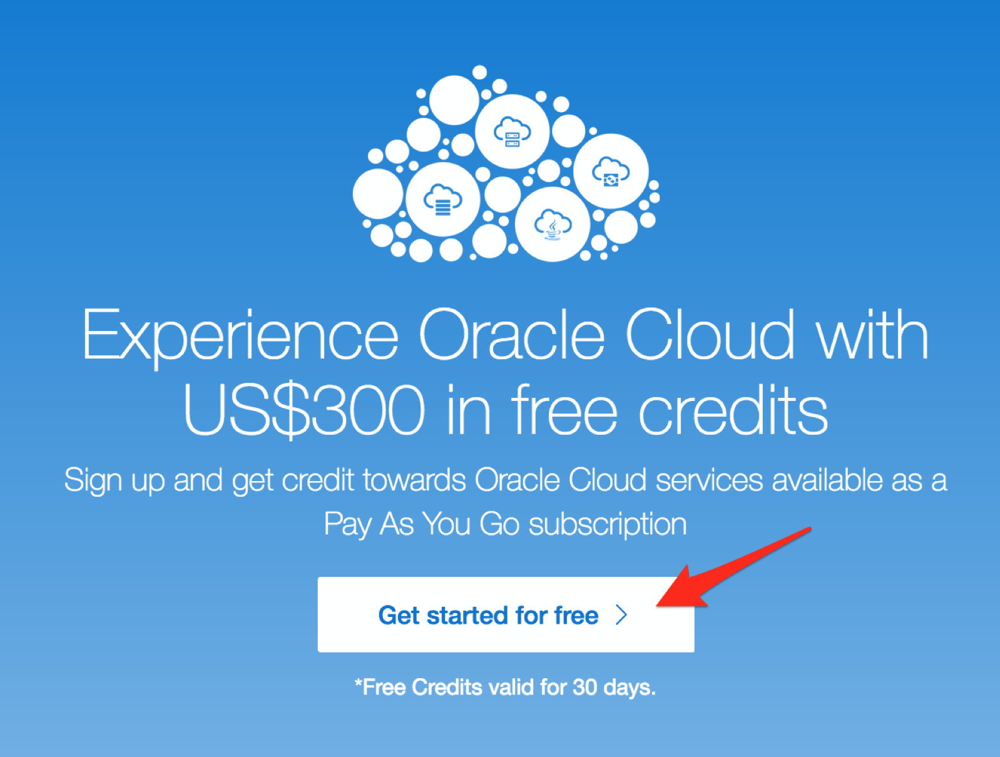

### 2. Create your Account

- Enter the required information on the **Create an Oracle Account...** page, and click on **Create Account**.

    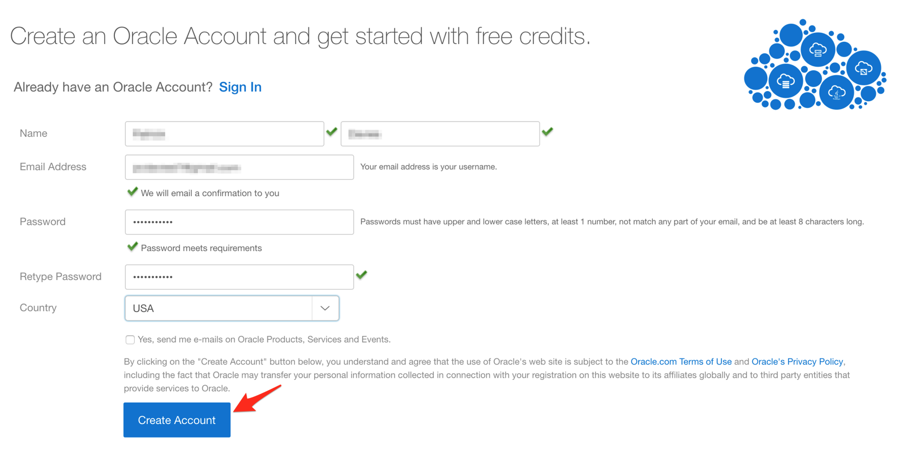

- The following dialog indicates that you will receive an confirmation email.

    

- Check your email, and click on the **Verify email address** button contained in the received email. 

    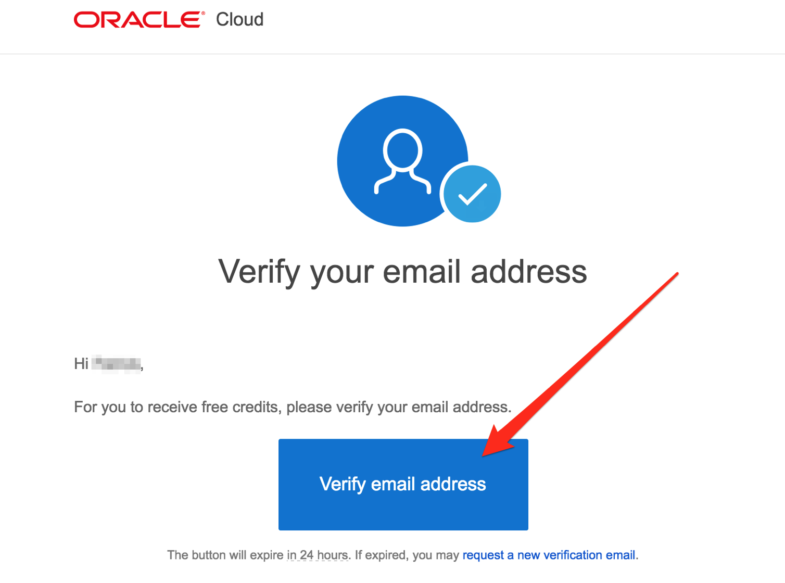

- After Verifing your email address, enter your email address into the **User Name** field, enter your **Password**, then click on **Sign In**.

    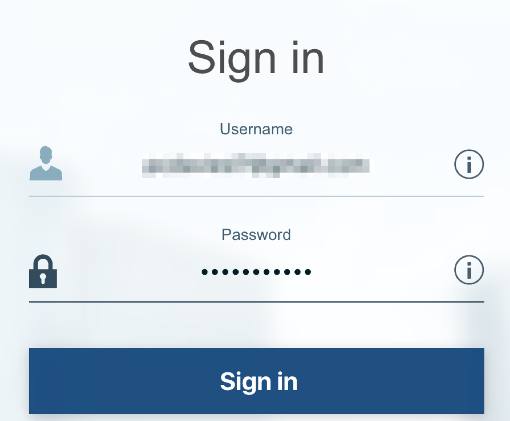

### 3. Verify your Phone Number

- Enter your **Mobile Phone Number** and click on **Request Code**

    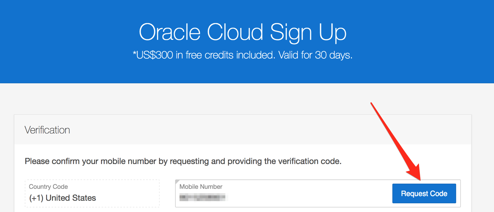

- Enter the **Verification Code** you receive via a phone text message.

    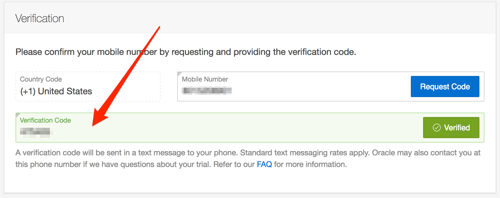

### 4. Enter Account Information

- Enter the required account information.

    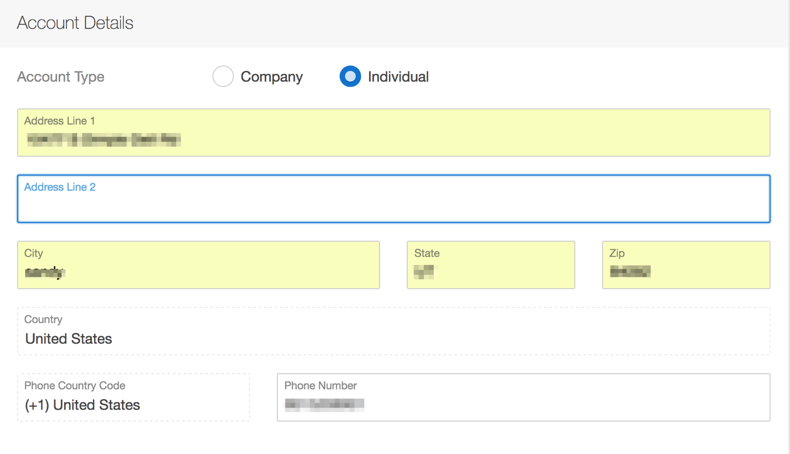

- Read the information about the use of your credit card, and Click on the **Add Payment Method** button.

    

- Enter your credit card information, and click on **Finish**.

    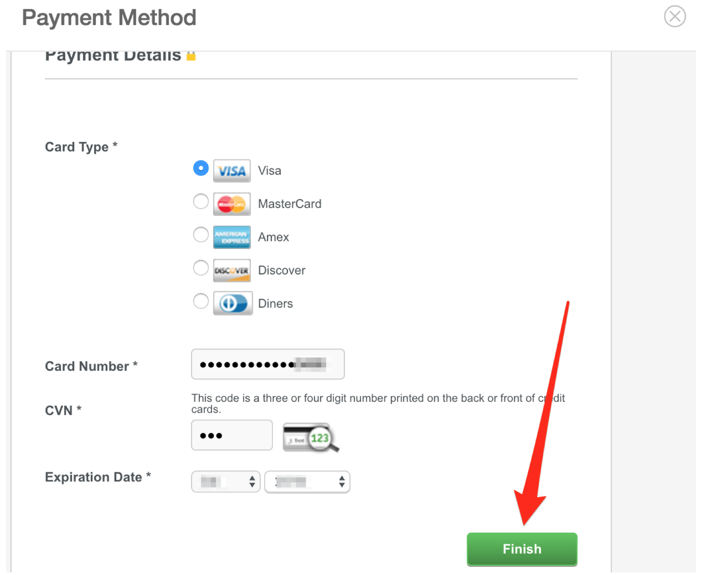

- **Accept** the terms and conditions, then click on the **Complete** Button. 

    

- Note the following steps.

    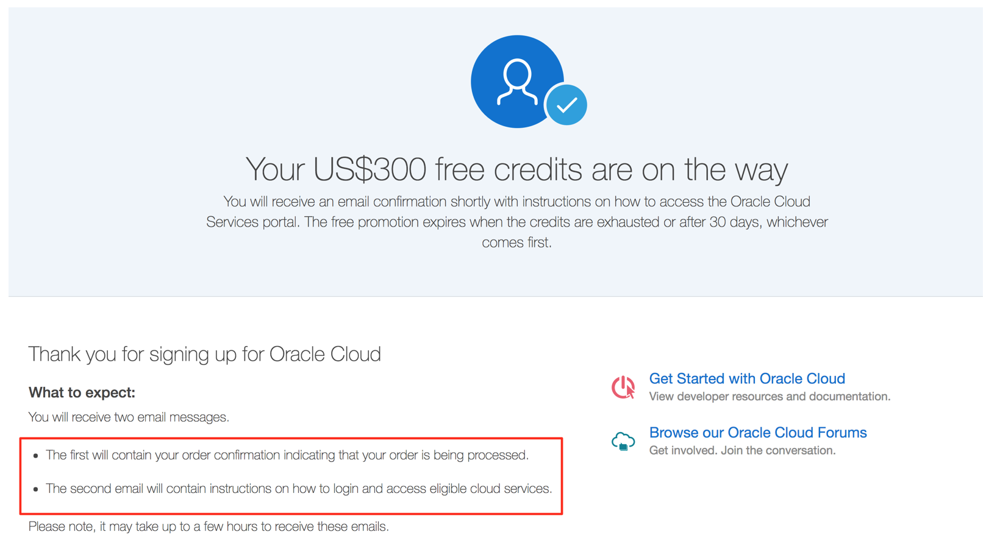

### 5. Account Confirmation

- The following is an example email confirming your Trial Account request.

    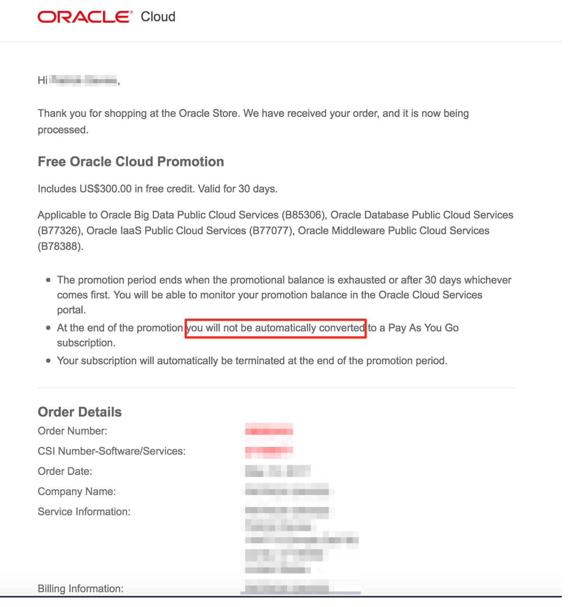

### 6. Confirmation Email

- Once your account has been provisioned, you will receive a **Confirmation Email** that will provide you with your **Identity Domain**, **Password** and **Username**. This email also contains a **My Services URL** link that will allow you to access and log into your account. You may also receive an separate email describing how to connect into to VPN, but in most cases VPN will not be needed for testing. 

    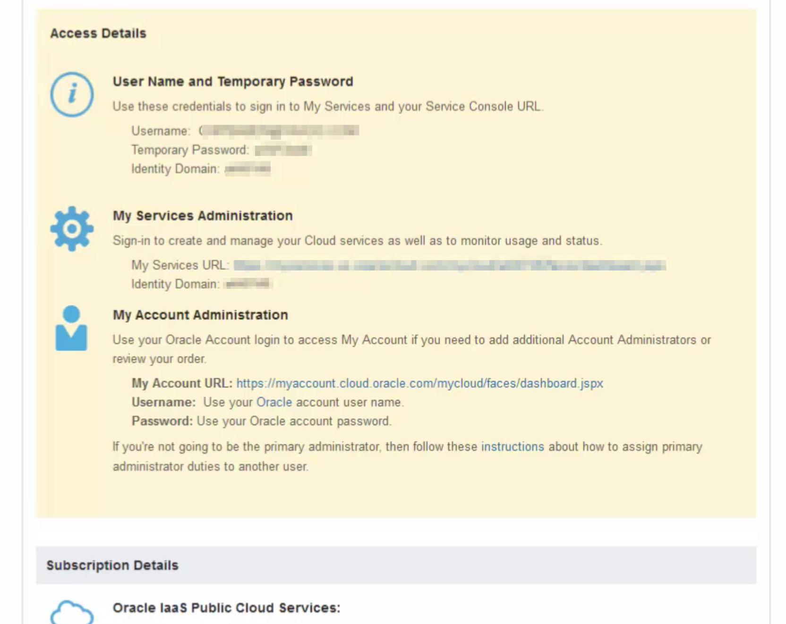

## Configure Your Storage Replication Policy

Once your Trial Account is fully approved and provisioned, you will need to set your Storage Replication Policy. We recommend that you do this as soon as your account is fully provisioned, otherwise some of the PaaS services that may be of interest will not work correctly. The Replication Policy is not automatically set to allow for flexibility on how how it is configured.

### Login to your Oracle Cloud Account
- Using the link ("My Services Administration" aka "My Services URL") and credentials provided in your confirmation email, log into your Oracle Trial Account. 

- Once logged in, you will be presented with a Dashboard displaying the various cloud services available to your account.

    

- If your **Storage** cloud service are not visible, **click** on the **Customize Dashboard**, which will allow you to add services to the dashboard by clicking **Show.** For example, you can show the **Application Container, Developer and Storage** cloud services. If you do not want to see a specific service, click **Hide**

    

### Check/Set Storage Replication Policy

Depending on the state of your Cloud Account, you will need to set the **Replication Policy**, if it has not been previously set. In this step you will go to the Storage Cloud Service to check on the status of the Replicaton Policy. 

- Click on the **Storage** Cloud Service
    

- Click on the **Open Service Console** icon at the top of the screen.

    

- Also, be sure to **Note the Identity Domain name** (a431644 in the above example screenshot).  Write down as you'll need it later.

- If the Replication Policy has not been set, use the default and click on the **Set Policy** button. If the message is not displayed, your replication policy has already been set, and your Cloud Account is ready for use.

    

- Your Replication Policy is now set, and Services that require a Replication Policy will work correctly.

    
# Additional notes about your Trial Account

**Note**: ensure you do ***NOT*** select "**Yes, convert my account to Pay as you go at the end of the free promotion**" located in the Billing Section, as Checking this option would convert your account to Pay as you go after the $300.00 credit or 30 days have been fulfilled. 

**Note**: Depending on the cloud services that you use, the consumption of your cloud credits can vary greatly, so ensure that you understand the pricing structure for each cloud service you intend to use. Also, based on the cost of an individual cloud services, you may want to shut that service down when not in use to conserve credits. Every cloud service will contain information about that service's pricing. As examples, here is a link to one of the cloud service pricing pages: 

[Big Data Cloud Service - Compute Edition Pricing](https://cloud.oracle.com/en_US/big-data-compute-edition/pricing)

# Next Steps

Proceed to [Workshop1.3.md](Workshop1.3.md) to provision your BDCS-CE instance.
