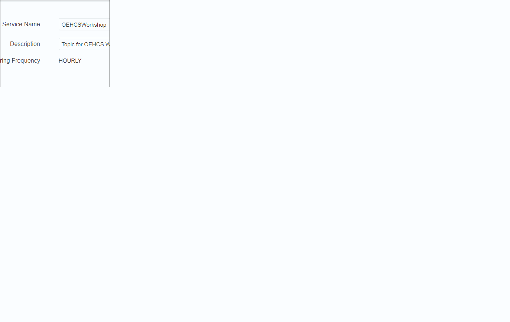
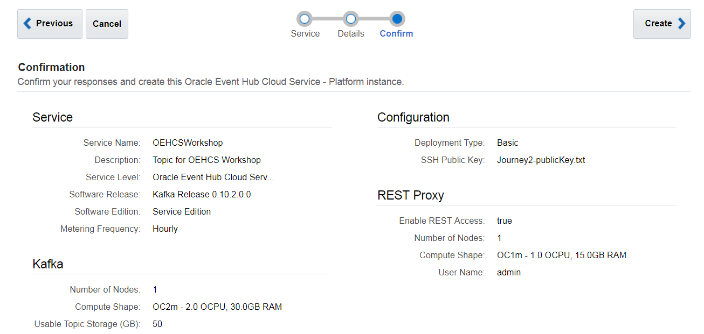
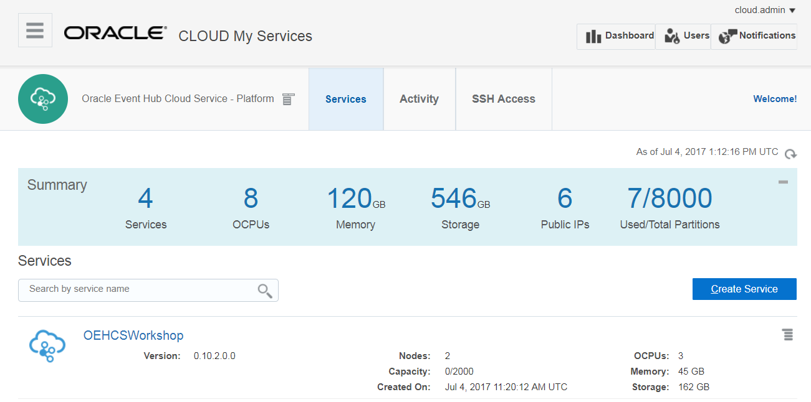
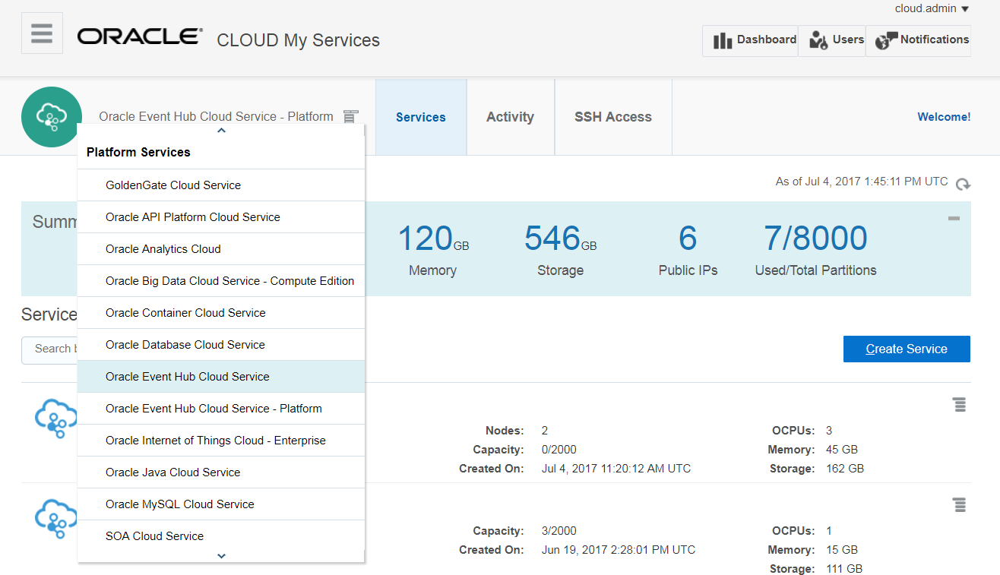

# Oracle Event Hub Cloud Service – Platform – Create Kafka Cluster

Select Oracle Event Hub Cloud Service – Platform from the Cloud Service menu.

You will be taken to the Event Hub CS – Platform landing page. Click on “Go to Console”

Click on “Create Service”

Fill the required details like Service Name and Description as shown below and click on "Next"

Once clicked on "Next" will be landed to Next page to fill in the information 
- Deployment Type :- There are two options available "Basic" and "Recommended".
- SSH Public Key :- Provide the public key can be same as created in Oracle Event hub cloud service or can be created new.
- Enable REST Api :-For Allowing sending and receiving the messages through REST this option should be selected as "Enable".
- Number of Nodes :-By default the number of Nodes is 1 we can increase to any number of nodes.

Provide the details required for your Kafka Cluster in the Details page. Note for the workshop we will use just 1 node to setup the Kafka cluster, we can add more later, if required. Setup SSH key access and also enable “REST Proxy”.
REST Proxy, allows you to interact with the Kafka service via REST api’s. Note down the user name and password that you provide here. Click “Next”

- Verify and Click “Create”.

Kafka Service is now created

Click on Serivce Name for getting Details of the service.

## Access Rules
For you to work with the Kafka platform just created, you need to open up Kafka and Zookeeper ports to work with your publishers and consumers.
We will use Kafka’s console producer and consumer to test the Kafka service. Later we will connect it with the Spark Service (BDCS-CE).

Click on the Menu next to the “<KafkaService>” in my case its OEHCSWorkshop and Select “Access Rules”

Once clicked on create you can view the same rules in previous page

Enter the required details. Note Kafka listens on port 6667, so destination port should be 6667. Source should ideally be you public IP address. For now I am setting it to PUBLIC-INTENET (not advised for production). Click “Create”
Similarly Open up access for Zookeeper port 2181.

## Note :- With the creation of REST proxy, we can always use REST API’s to access Kafka’s resources. The Access rules are required if you intend to access Kafka using its native API’s.

## Kafka Topic

Lets create a Kafka Topic and then publish and consume messages directed towards this topic.
From the Menu next to “Oracle Event Hub Cloud Service – Platform” header, select Oracle Event Hub Cloud Service (note, this time you are not selecting Platform, platform will create a Kafka Cluster, the regular Event Hub Service, will create a managed Topic).

Click on “Create Service” from the Create Service Page

# Using the Service

Lets now use Kafka Console producer and consumer to test this topic.
For this you need to install Kafka 0.10.2.0.0 binaries on your laptop/desktop.
Once installed go to location where you installed KAFKA called KAFKA_HOME

Get the Public IP address from the OEHCSWorkshop
 details page. The Public IP is listed in the details page.

 

Lets list the kafka topics using kafka-topics.sh script.

 

once the topic we created is shown as above we can try sending some messages and receiving messages.

### Notice the topic we create is prefixed with the identity domain name (consider it the namespace for the topic)

Lets run kafka console producer and consumer to publish and consume data.

- Command to produce messages 
./kafka-console-producer.sh --broker-list 141.144.29.113:6667 --topic gse00010212-kafkaforoehpcs

- Command to receive/consume messages
./kafka-console-consumer.sh --zookeeper 141.144.29.113:2181 --topic gse00010212-kafkaforoehpcs

# RESTful API’s

We can also use REST Proxy to list topics, produce and consume messages. Lets look at an example.

Get the REST proxy details from the Kafka Service (Platform) overview, by clicking on the service name. Note down the Public IP.

Lets use REST call to list out topics. You can use any REST client of your choice(postman, a chrome addon is good). we are showing using curl.

- To list Topics: (For Windows Curl use Double Quotes)

Command to list the topics using curl

curl -i -X GET -u 'admin:Welcome123' -H 'X-ID-TENANT-NAME: cloud.admin' -H 'Accept: application/json' 'https://141.144.29.129:1080/restproxy/topics' -k

### To Consume messages
Steps:
1.	Create a Consumer Instance
2.	Consume message from a Topic (or a partition)

Create consumer instance: Make a POST call to the restproxy as below:
REST URL format: /restproxy/consumers/{groupName}

- command to create consumer group

curl -i -X POST -u "admin:Welcome123" -H "X-ID-TENANT-NAME: cloud.admin" -H "Accept:application/json" "https://141.144.29.129:1080/restproxy/consumers/myTestGroup1" -k

- Consume message from a Topic: Make a GET call as below
REST URL Format: /restproxy/consumers/{groupName}/instances/{consumerInstanceId}/topics/{topicName}

The command to consume message is shown below

Need to copy the instance ID from above output and run the below command

curl -i -X GET -u "admin:Welcome123" -H "X-ID-TENANT-NAME: cloud.admin" -H "Accept :application/json" "https://141.144.29.129:1080/restproxy/consumers/myTestGroup1/instances/rest-consumer-oehcsworkshop-restprxy-1.compute-gse00010212.oraclecloud.internal-b1c03ee1-d9a9-4210-ba6b-21cac45e0597/topics/gse00010212-kafkaforoehpcs/" -k --cacert C:\Users\sambjain\Downloads\curl-7.54.1\I386\curl-ca-bundle.crt

Notice that the above REST call returned an empty array, lets now produce some messages using the REST produce API

Command to send and receive messages from Windows using curl command first list the topic

curl -i -X GET -u "admin:Welcome123" -H "X-ID-TENANT-NAME: cloud.admin" -H "Accept: application/json" "https://141.144.29.129:1080/restproxy/topics" -k

Now send some messages and consume.

Get the instance ID by running below command

curl -i -X POST -u "admin:Welcome123" -H "X-ID-TENANT-NAME: cloud.admin" -H "Accept: application/json" "https://141.144.29.129:1080/restproxy/consumers/myConsumerGroup" -k

Below is the command to send the message to Kafka

curl -i -X POST -u "admin:Welcome123" -H "cache-control: no-cache"   -H "content-type: application/vnd.kafka.v1+json" -H "X-ID-TENANT-NAME: gse00010212" "https://141.144.29.129:1080/restproxy/topics/gse00010212-kafkaforoehpcs" --data "{ \"records\":[ {\"key\":\"name\",\"value\":\"Y29uZmx1ZW50\" }] }" -k

command to receive the message

curl -i -X GET -u "admin:Welcome123" -H "X-ID-TENANT-NAME: gse00010212" -H "Accept: a
pplication/json" "https://141.144.29.129:1080/restproxy/consumers/mynewtest/instances/rest-consumer-oehcsworkshop-restprxy-1.compu
te-gse00010212.oraclecloud.internal-901666d2-57dd-498d-887a-de66c3b308ec/topics/gse00010212-kafkaforoehpcs/" -k

# What you Learned

- Learned how to setup OEHCS to communicate with BDCS-CE
- Learned how to create a topic in OEHCS
- Learned how to write a data to OEHCS using REST Api
- Learned how to retrive a data from OEHCS usin REST Api

# Next Steps

- Experiment with your own data

